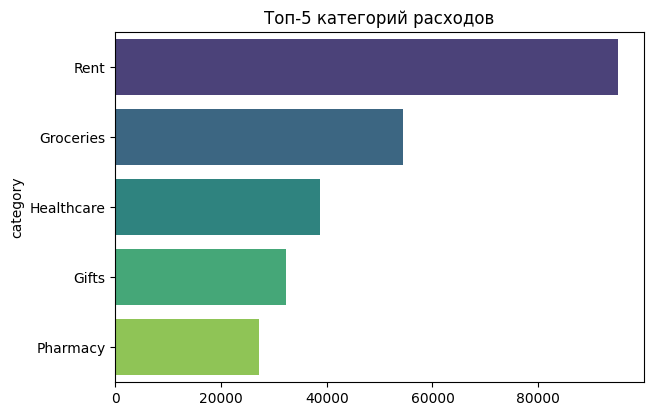
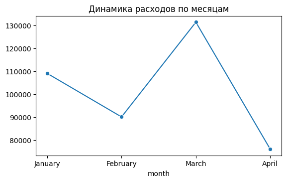
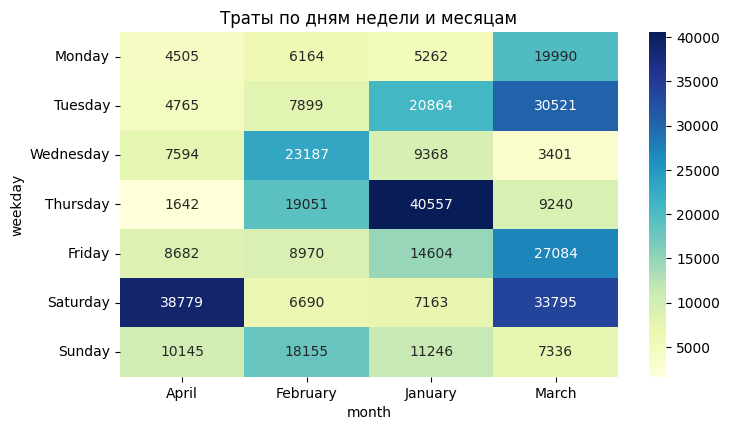

# 💰 Персональный финансовый анализ

***Статус проекта: Завершен***

## Описание проекта

Этот проект представляет собой углубленный анализ персональных финансовых транзакций за четыре месяца. Его основная задача — выявить ключевые паттерны расходов, найти аномалии и предоставить actionable insights (практические выводы) для оптимизации личного бюджета. Проект демонстрирует полный цикл работы аналитика: от предобработки сырых данных до подготовки итогового аналитического отчета с визуализациями.

**Цель проекта:**
*   Провести предварительную обработку и очистку данных для обеспечения их качества и пригодности для анализа.
*   Выполнить исследовательский анализ данных (EDA) для понимания общей финансовой картины.
*   Визуализировать структуру расходов и их динамику во времени.
*   Выявить ключевые финансовые паттерны, аномалии и тренды с помощью статистических методов и анализа временных рядов.
*   Сформировать итоговый аналитический отчёт, содержащий практические рекомендации по управлению личными финансами.

## Используемые технологии

*   **Python:** Основной язык анализа.
    *   `pandas`: Для манипуляций, обработки и анализа данных.
    *   `matplotlib` & `seaborn`: Для создания информативных и эстетичных визуализаций.
    *   `statsmodels`: Для анализа временных рядов и выявления трендов.
*   **Jupyter Notebook:** Для интерактивного анализа и структурированного представления результатов.
*   **Git / GitHub:** Для контроля версий и хостинга проекта.

## Данные

Данные для анализа представлены в файле `transactions(Jan-April_2025).csv` и содержат записи о транзакциях за период с января по апрель 2025 года.

*   `date`: Дата и время транзакции
*   `category`: Категория расхода (например, Groceries, Rent, Fuel)
*   `amount`: Сумма транзакции (в качестве десятичного разделителя используется запятая)
*   `type`: Тип транзакции (в данном датасете — 'expense')

## Ключевые этапы анализа

1.  **Загрузка и предобработка данных:** Загрузка CSV-файла с учетом разделителя-точки с запятой, преобразование колонки `amount` в числовой формат, парсинг дат.
2.  **Исследовательский анализ (EDA):** Расчет общих и средних расходов, анализ трат по категориям, определение самых затратных статей бюджета.
3.  **Анализ временных рядов:** Изучение динамики расходов по месяцам и неделям для выявления сезонности, цикличности и общих трендов.
4.  **Выявление аномалий:** Поиск нетипично крупных транзакций, которые могут сигнализировать о разовых крупных покупках или ошибках в данных.
5.  **Визуализация и отчетность:** Создание наглядных графиков (круговые диаграммы, гистограммы, тепловые карты) и формулирование выводов в виде финального отчета.

## Основные инсайты и выводы

В ходе анализа были выявлены следующие ключевые закономерности:

*   **Структура расходов:** Три крупнейшие категории расходов, составляющие более 50% всего бюджета, — это **"Rent" (Аренда)**, **"Groceries" (Продукты)** и **"Healthcare" (Здравоохранение)**. Это указывает на то, что основные траты являются обязательными.
*   **Ежемесячные тренды:** Наблюдается **устойчивый рост расходов от месяца к месяцу**, с пиком в марте, который был вызван значительными тратами в категориях **"Gifts" (Подарки)** и **"Clothing" (Одежда)**.
*   **Паттерны покупательского поведения:** Расходы на **"Groceries" (Продукты)** имеют тенденцию к увеличению в конце недели (пятница-суббота), что соответствует типичному паттерну еженедельных закупок.
*   **Финансовые аномалии:** Была выявлена аномально крупная транзакция в категории **"Fitness"** в апреле. Анализ показал, что это, вероятнее всего, **единовременная покупка годового абонемента**, а не регулярный ежемесячный расход.
*   **Потенциал для оптимизации:** Категории **"Dining" (Рестораны)** и **"Entertainment" (Развлечения)** демонстрируют высокую частоту небольших трат. Сокращение расходов в этих "необязательных" категориях имеет наибольший потенциал для быстрой оптимизации бюджета без влияния на базовые потребности.

Эти выводы позволяют не только оценить текущее финансовое состояние, но и выработать конкретную стратегию по управлению расходами на будущие периоды.

## Примеры визуализаций

### Структура расходов по основным категориям

### Динамика общих расходов по месяцам

### Тепловая карта расходов по дням недели и категориям

