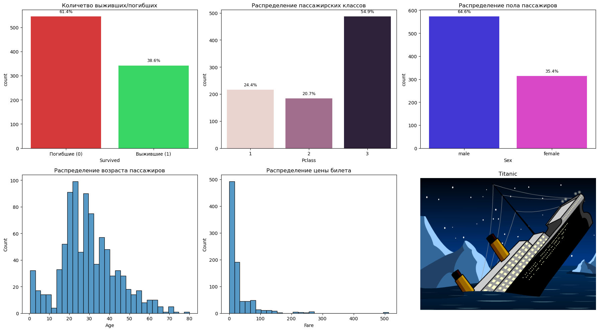
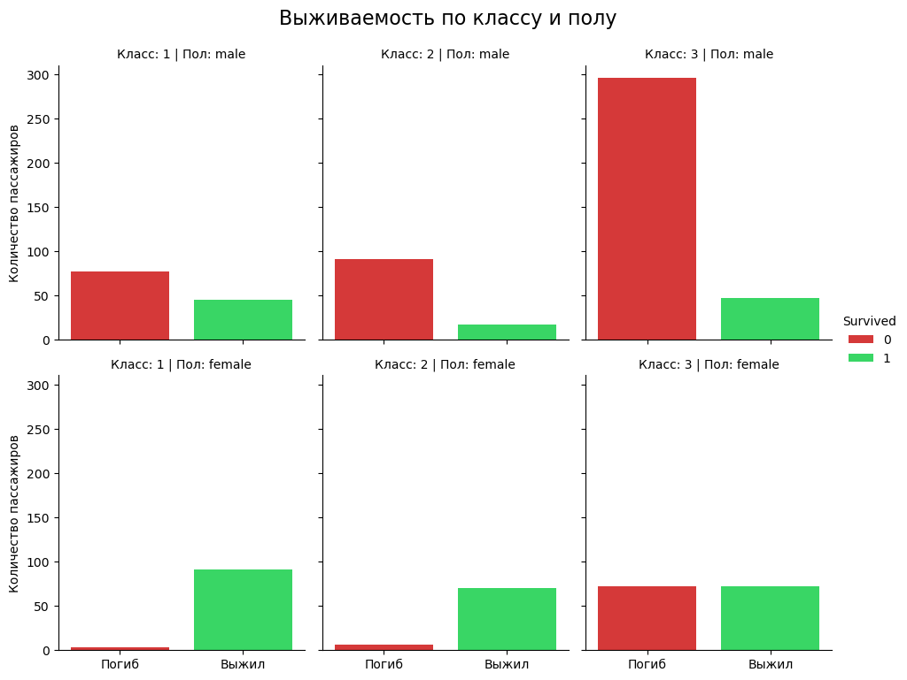
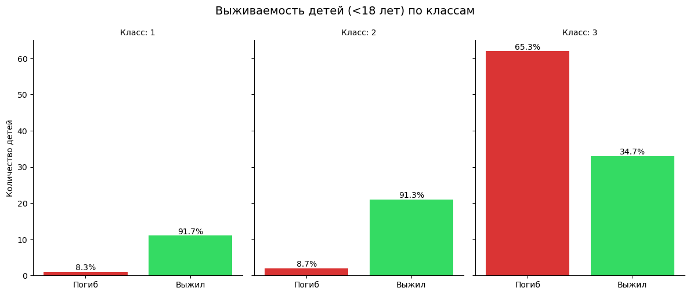

# 🚢 Анализ выживаемости на Титанике

## Описание проекта

Этот проект представляет собой анализ данных о пассажирах лайнера "Титаник" с целью выявления ключевых факторов, повлиявших на их выживаемость в морской катастрофе. Он служит моим пет-проектом для поступления в **Академию Аналитиков Авито** и демонстрирует навыки в области аналитики, включая работу с данными, их очистку, исследовательский анализ (EDA), визуализацию и извлечение значимых инсайтов.

**Цель проекта:**
*   Провести разведочный анализ данных для понимания структуры и качества датасета.
*   Очистить данные от пропусков и создать новые, информативные признаки.
*   Визуализировать распределения ключевых переменных.
*   Выявить и проанализировать факторы, которые статистически значимо влияли на шансы выживания пассажиров.
*   Сформулировать аналитические выводы, демонстрирующие глубокое понимание данных.

## Используемые технологии

*   **Python:** Основной язык анализа.
    *   `pandas`: Для манипуляций и анализа данных.
    *   `matplotlib`: Для базовой визуализации.
    *   `seaborn`: Для создания эстетичных и информативных статистических графиков.
*   **Jupyter Notebook:** Для интерактивного анализа и представления результатов.
*   **Git / GitHub:** Для контроля версий и хостинга проекта.

## Данные

Данные получены из стандартного датасета "Титаник", который часто используется для задач анализа данных и машинного обучения. Файл `titanic.csv` содержит следующую информацию о каждом пассажире:

*   `Survived`: 0 = Нет (погиб), 1 = Да (выжил) - *Целевая переменная*
*   `Pclass`: Класс билета (1 = 1-й, 2 = 2-й, 3 = 3-й)
*   `Name`: Имя пассажира
*   `Sex`: Пол (male/female)
*   `Age`: Возраст
*   `Siblings/Spouses Aboard`: Количество братьев/сестер или супругов на борту
*   `Parents/Children Aboard`: Количество родителей или детей на борту
*   `Fare`: Стоимость билета

## Ключевые этапы анализа

1.  **Загрузка и первичный обзор данных (EDA):** Проверка типов данных, пропущенных значений, базовых статистик.
2.  **Очистка данных и Feature Engineering:** Заполнение пропусков в `Age` (с учетом медиан по группам), создание признаков `FamilySize` (общий размер семьи) и `IsAlone` (является ли пассажир одиночкой).
3.  **Детальный анализ выживаемости:** Исследование влияния пола, класса, возраста и размера семьи на шансы выжить, а также их комбинаций.

## Основные инсайты и выводы

В ходе анализа были выявлены следующие ключевые закономерности:

*   **Общая статистика:** При крушении судна выжило **чуть больше трети** от общего количества пассажиров (около 38.4%). Погибло - **примерно 61.6%**.
*   **Распределение по классам:** Пассажиров третьего класса было **значительно больше** (~1.23 раза), чем пассажиров 1-го и 2-го классов вместе взятых, что указывает на преобладание менее обеспеченных слоев населения на борту.
*   **Демография пассажиров:** Подавляющее большинство пассажиров составляли **мужчины**. Наиболее многочисленная возрастная группа среди пассажиров (и особенно среди мужчин) — это люди в возрасте от **20 до 35 лет**. Медианная стоимость билета на Титаник составила **~14.45£**.
*   **Влияние пола и класса (ключевой инсайт):**
    *   Принцип "женщины и дети в первую очередь" не был абсолютным и **значительно зависел от класса билета**.
    *   **Женщины и дети 1-го и 2-го классов** имели чрезвычайно высокие показатели выживаемости (например, женщины 1-го класса - **96.8%**, дети 1-го класса - **91.7%**, дети 2-го класса - **91.3%**). Это говорит о том, что в этих классах приоритет спасения был реализован наиболее эффективно.
    *   **Выживаемость женщин и детей 3-го класса** была значительно ниже. Например, дети 3-го класса имели лишь **34.7%** шансов на выживание. Женщины 3-го класса выживали с вероятностью около **50%**. Это показывает, что классовая принадлежность (социально-экономический статус) была **более доминирующим фактором**, чем пол или возраст, особенно для пассажиров 3-го класса, чьи шансы на спасение могли быть даже ниже, чем у взрослых мужчин из 1-го класса.
*   **Влияние размера семьи:** Пассажиры, путешествующие в небольших и средних семьях, имели тенденцию к более высокой выживаемости по сравнению с одиночками или очень большими семьями.

Эти выводы подчеркивают, что катастрофа "Титаника" была не только трагедией, но и отражением социального неравенства того времени, где доступ к спасательным средствам был сильно дифференцирован по классовому признаку.

## Примеры визуализаций

# Визуализация распределений основных атрибутов

# Выживаемость по классу и полу

# Выживаемость детей по кассам

